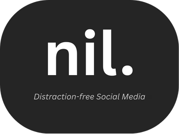

# Nil: Distraction-free Social Media

  

Nil is an all-in-one browser extension that simplifies social media UIs by removing addicting elements.

## Current Features

### YouTube
-   **Oversimplified Mode**: Minimalist, Google-style homepage (logo + search bar only).
-   **Search Feed**: Toggle between clean list view (text-only) or standard grid.
-   **Content Blocking**: Simplify or disable Home Feed, Sidebar, Comments, and Navbar.
-   **Smart Scoping**: Sidebar and Chat rules apply only to the Watch page.

### Reddit
-   **Feed Control**: "Simplify" (Text-only) or "Disable" the Main Feed.
-   **Sidebar & Widgets**: Simplify or Disable the Sidebar content.
-   **Content Toggles**: Disable "Recently Viewed" and "Subreddit Descriptions".
-   **Conversation Focus**: Simplify or Disable Comments and Messages.

## Planned Features

Targeting doom-scrolling on other platforms:
-   **Facebook**: Block News Feed, Stories, Watch Tab.
-   **Instagram**: Block Explore, Reels, Stories.
-   **Twitter/X**: Block "For You" timeline.
-   **TikTok**: Block "For You Page". 
-   **Advanced Customization**: Granular settings to toggle specific features across all platforms. 

## Installation

1.  Clone repo & `npm install`
2.  `npm run build:popup`
3.  Load unpacked `src` folder in `chrome://extensions` (Developer Mode).

## Development

-   `npm test`
-   `npm run build:popup`

## Contributing

Contributions are welcome! Please feel free to submit a Pull Request.

## License

This project is licensed under the GNU General Public License v3.0. See the [LICENSE](LICENSE) file for details.